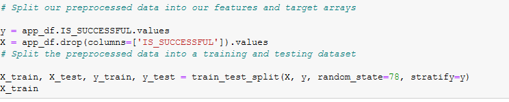
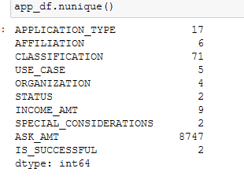

# neural_network_charity_analysis

### Overview
  The purpose of this analysis was to utilize machine learning to build a deep neural network on a dataset. The dataset would be contain information on 34,000 charity organizations and the deep neural network will predit if the applicants were successful after being funded. The data will have to be preprocessed, using methods such as as binning, dropping columns, and using onehoencoder. After being preprocessed the data will be split and fit into a training model and subsequently optimized.

### Results

##### Preprocessing
* The variable being considered as the target for this model would be the IS_SUCCESSFUL values. The image below shows the data being split between the target and features.

* The variable being considered as features for for the training model are in the following image: 

* The variables that were not pertinent to the data analysis and were removed from the dataset, would be the indentifying columns such as the organizations name and EIN.

##### Compiling, Training, and Evaluating the Model
* For the initial model the following were used:
* 2 hidden layers
* 80 neurons for the first layer because the good practice dictates using twice the number of neurons for input dims, and 30 neurons for the second
* relu as the activation method, and sigmoid as the output method. Both were used as standard good practice.
* The target model performance accuracy was 75% the initial model yielded an accuracy of 73%
* Several attempts were used to increase performance accuracy:

* change of activaction and out method to sigmoid and tanh respectivly
* an additional hidden layer and more neurons
* change of activation method, more epoch duration, less neurons used

### Summary
  In summation of the deep learning model and its subsequent attempts to optimize the model, the model perfomance accuracy continued to oscilate around 73% never quite showing improvements throughout the attempts. Upon changing activation methods, adding additional hidden layers, mixing neuron counts and raising epochs to 1000 there was no meaningful change to perfomance accuracy. A recommendation to improve classification in this model would be attempt using SVM and comparing performance between the two to see if there are any descrepancies between the two methods.

  
